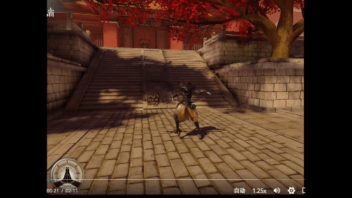
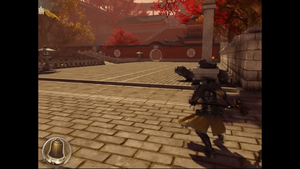
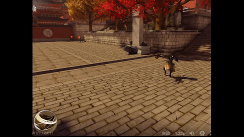
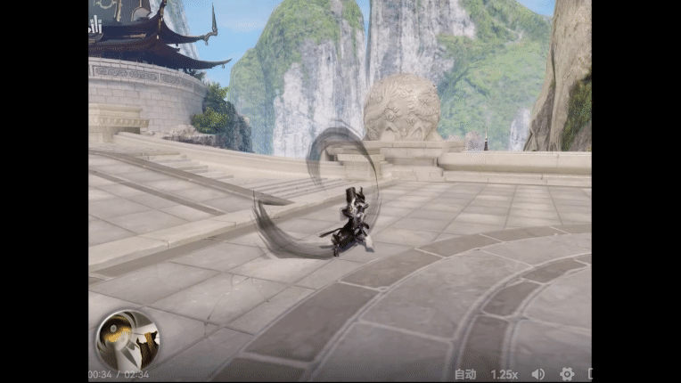
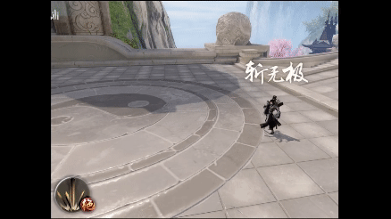
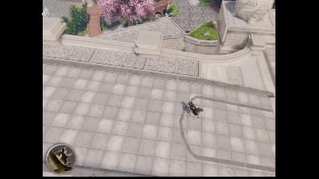
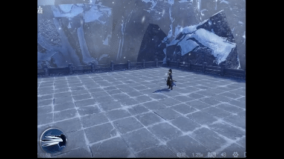
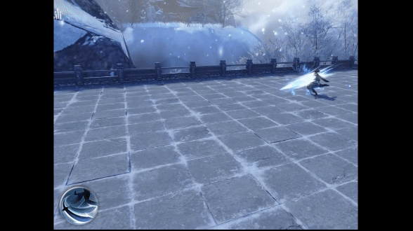

[Python, C++, Gameplay Development, Messiah Engine, Animation State Machine, CocosUI]
This is a brief demonstration of the new skill system I developed for the MMO game 'A Dream of Jianghu'.
<h3>Skill Tree UI System for 12 different classes</h3>
<figure>

</figure>
 
<figure>

</figure>
<h3>Demo Skills</h3>
<figure>

</figure>
<figure>

</figure>
<figure>

</figure>
<figure>

</figure>
<figure>

</figure>
<figure>

</figure>
<figure>

</figure>
<figure>

</figure>