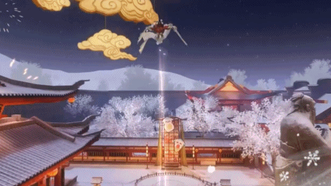

[Python, C++, Gameplay Development, Messiah Engine, Animation State Machine, CocosUI]
This is a brief overview of the diverse gameplay elements I developed for the MMO game 'A Dream of Jianghu' during the Chinese New Year period. My contributions encompassed creating features for the rollercoaster, carousel, hot air balloon, and toy gameplays. Moreover, I played a key role in debugging, performance optimization, and assisting with the successful release of the game.
<h3>Various Online Interaction Gameplays</h3>
Rollercoaster gameplay
<figure>

</figure>

Carousel gameplay
<figure>

</figure>

Hot air balloon gameplay
<figure>

</figure>

Toy gameplay
<figure>

</figure>

Trampoline gameplay
<figure>

</figure>

Ferris wheel gameplay
<figure>

</figure>

<figure>

</figure>

