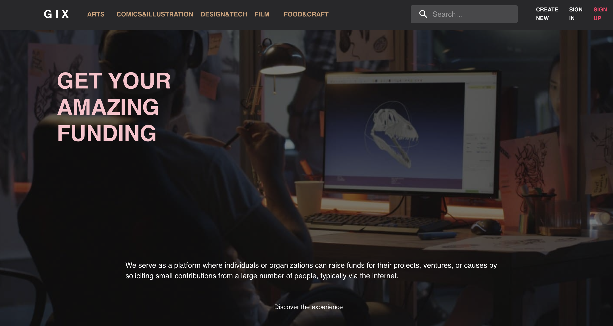
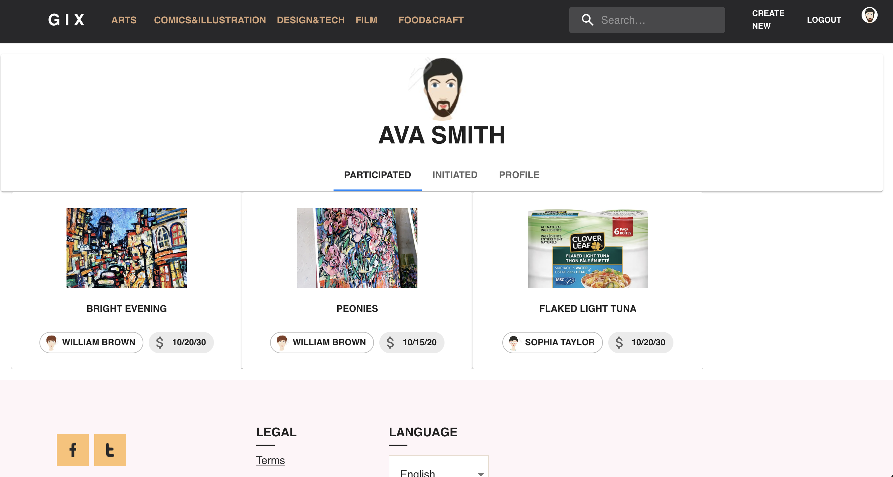
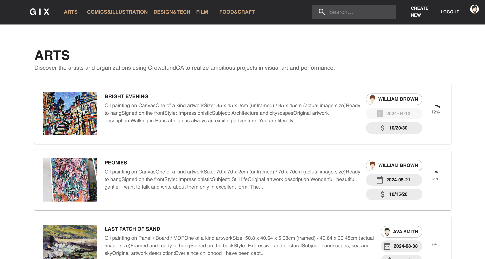
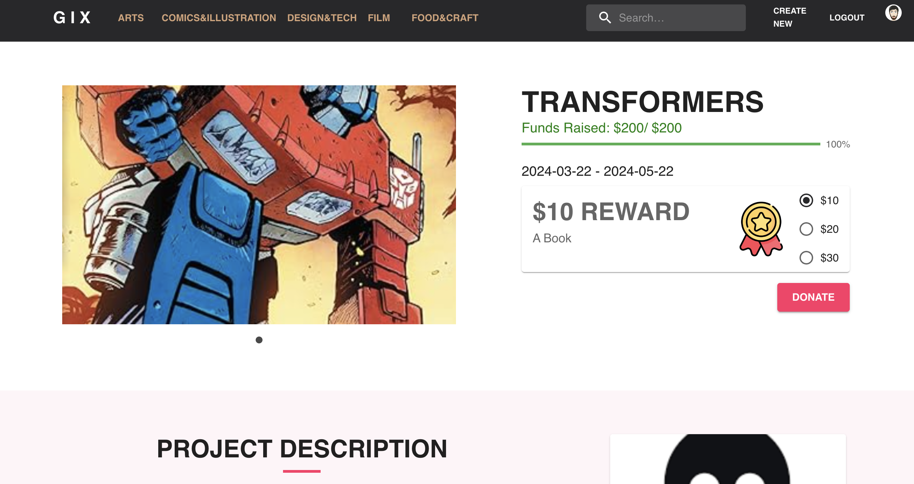
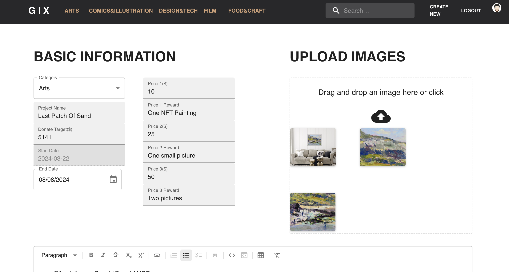

<a href="https://github.com/NiborZ/ReactProject_CrowdfundCA" rel="noopener">@github_link</a>
<h3>Project Presentation</h3>
<iframe src="/assets/pdf/react_project.pdf" style="width: 100%;height: 600px;border: none;"></iframe>
<figure>
<h3>Example Pages</h3>

</figure>
<figure>

</figure>
<figure>

</figure>
<figure>

</figure>
<figure>

</figure>